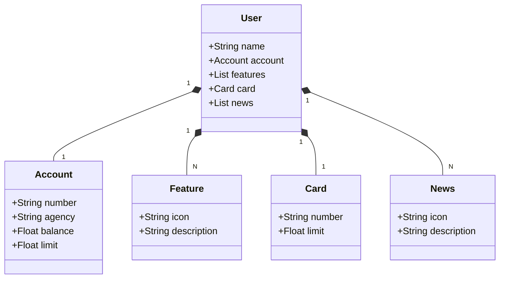

# ApiRestFull_Modelo
Criação de uma API Resful modelo para consultas e futuras

## 🚀 Projeto criado no Santander Dev Week 2023 - BootCamp DIO.ME

  

## Tecnologias Utilizadas

 

### Diagrama de classes 

[Mermaid DOCs](https://mermaid.js.org/intro/)

 

## 🖥️ Open API (Swagger)

[API Swagger Open API ](http://localhost:8080/swagger-ui/index.html#/)

