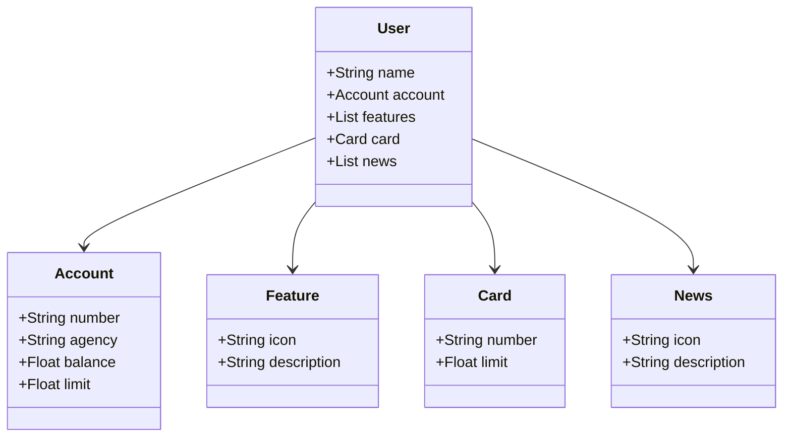

# ApiRestFull_Modelo
Criação de uma API Resful modelo para consultas e futuras

## Projeto retirado do Santander Dev Week 

### Diagrama de classes 

```mermaid
classDiagram
    class User {
        +String name
        +Account account
        +List<Feature> features
        +Card card
        +List<News> news
    }

    class Account {
        +String number
        +String agency
        +Float balance
        +Float limit
    }

    class Feature {
        +String icon
        +String description
    }

    class Card {
        +String number
        +Float limit
    }

    class News {
        +String icon
        +String description
    }

    User --> Account
    User --> Feature
    User --> Card
    User --> News

```
